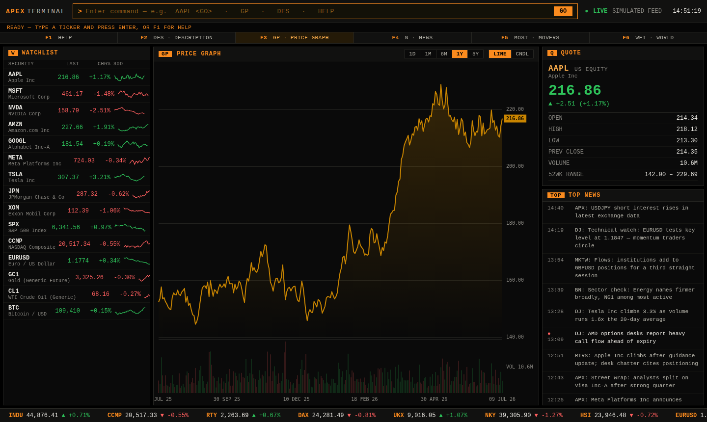
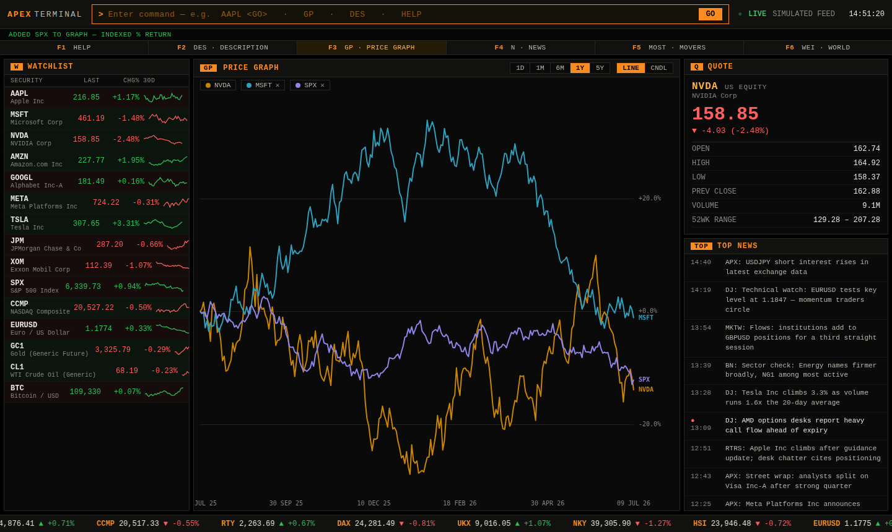

# APEX TERMINAL

A Bloomberg-terminal-style market workstation that runs entirely in the browser —
zero dependencies, no build step, no network calls. All market data is simulated
by a deterministic random-walk engine with live ticks.



## Run it

Open `index.html` in any modern browser. That's it.

Or serve it locally if you prefer:

```sh
python3 -m http.server 8000
# → http://localhost:8000
```

## Using the terminal

Type commands into the amber command line and press **ENTER** (`<GO>`).
Commands are case-insensitive.

| Command | What it does |
|---|---|
| `AAPL` (any ticker) | Load a security — equities, indices, FX, commodities, crypto |
| `DES` | Security description & key statistics (**F2**) |
| `GP` | Price graph — line or candlesticks, 1D → 5Y ranges (**F3**) |
| `N` | News wire for the loaded security (**F4**) |
| `MOST` | Most-active movers ranked by day change (**F5**) |
| `WEI` | World markets — indices, FX, commodities, digital assets (**F6**) |
| `COMP MSFT` | Overlay a comparison on the graph, indexed % return (up to 3) |
| `CLR` | Clear comparison overlays |
| `W ADD TSLA` / `W DEL TSLA` | Manage the watchlist |
| `HELP` | Command reference (**F1**) |



## Features

- **Command line** with Bloomberg-style mnemonics and function keys F1–F6
- **Live simulated feed** — prices tick every 1.5s; watchlist rows flash on trades
- **Price graphs** on canvas: line/area and hollow-candle modes, volume pane,
  crosshair with OHLCV tooltip, last-price axis tag
- **Comparison mode**: up to 4 securities indexed to a common % base (one axis),
  with direct line labels and legend chips
- **Watchlist** with 30-day sparklines, **quote panel**, **DES** security pages,
  a generated **news wire**, and a scrolling **market tape**
- **28-security universe**: US large caps, global equity indices, G10 FX,
  commodities futures and crypto

## How the data works

`js/data.js` seeds a per-symbol PRNG (mulberry32) and generates ~5 years of
daily OHLCV plus an intraday minute series via a geometric random walk, rescaled
so each symbol lands on a realistic anchor price. A tick loop then evolves the
last price live and feeds every panel. Nothing leaves the page — it works
offline.

## Project layout

```
index.html          markup & views
css/terminal.css    dark amber-on-black terminal theme
js/data.js          simulated market data engine + news wire
js/chart.js         canvas chart renderer (line/candles/compare) + sparklines
js/app.js           command parser, views, watchlist, tape, live loop
```

Chart series colors (`#c98500`, `#2f9fbc`, `#9085e9`, `#e66767`) are validated
for colorblind-safe separation and ≥3:1 contrast on the black chart surface;
series identity is never carried by color alone (direct labels + legend chips).
